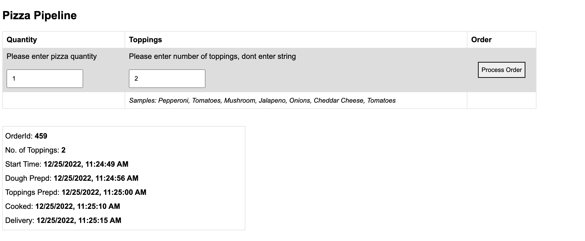
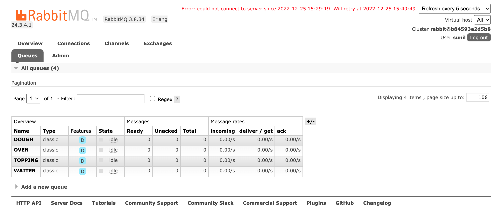

# Pizza restaurant app using Node.js and RabbitMQ

### Live preview

[Application](http://87.200.95.206:7085/)

[RabbitMQ](http://87.200.95.206:7087/)

### Requirement
Your task is to manage a Pizza restaurant - the restaurant receives an array of
orders, while each order is for one Pizza that contains an array of toppings.

The dough-to-pizza pipeline is:
##### Dough chef -> Topping chef -> Oven -> Serving
When a certain station within the pipeline is completed, the pizza moves to the next one. There are no dependencies between the orders in the arrays - when an order is ready to be served, it is being deployed to the customer.

###### The restaurant personnels are:
* 2 dough chefs - each chef can handle one dough at a time. It takes 7 seconds to
prepare each dough.
* 3 topping chefs - each chef can handle 2 toppings at a time. It takes 4 seconds to put each topping on the Pizza.
* 1 oven that takes one pizza each time and cook it for 10 seconds.
* 2 waiters that serve the pizza to the customers. From the kitchen to the table it takes 5 seconds.

Each process should print logs (start and end time).
In the end, when all the orders had been served, you need to print a report about the the complete set of orders. The report should contain:
* The preparation time from start to end
* The preparation time for each order

### Prerequisites
Considering you know about Node.js and Docker
### Installing
A step by step installation instruction about how to run the application
Clone the repository
```
git clone https://github.com/sunilmnagre/pizza-pipeline.git
```
Navigate to the cloned foler
```
npm install
```

Now, start the application using Docker compose
```
docker-compose up
```
Open the browser and navigate to
```
http://localhost:7085
```

If you want to check RabbitMQ
```
http://localhost:7087
```
Previews
Application
<p align="center">
        
</p>

RabbitMQ
<p align="center">
        
</p>

### Note
1) RabbitMQ take sometime to start at very firsttime, so please restart your application if connection fails. We can manage it by applying rule *wait-for-it* but due to time, I did not add that.
2) If you will face issue with crendentails then you can perform below task
```
docker exex -it messageq bash
```
```
rabbitmqctl add_user sunil admin
rabbitmqctl set_user_tags sunil administrator
rabbitmqctl set_permissions -p / sunil ".*" ".*" ".*"
```
sunil - Username, admin - Password, you can select your if you want
3) Test cases can be added
4) We can add logging on each level into the file/db to track process